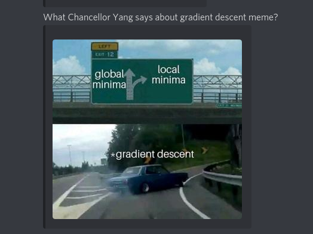

# UCSB Lectures Memebot
This is a bot that listens to your Zoom lectures, recognize the topic, and send you top memes to your Discord channel :D

### Special for Santa Barbara Hack VIII!

## Serious part (seriously)
Everyone knows that sometimes you just lose concentration on your lecture and become a bit tired of it.
We provide a solution to how to stay motivated - a memebot! This bot sends memes about the current topic on the lecture, so
if you're discussing gradient descent or Max-Q (some aerospace term), you'll receive some funny pictures about this.

We believe that this bot helps people:
- You can stay concentrated on the lecture topic
- Your mind receives a small piece of information that makes you smile (and smiling is important for concentration!)
- You know more jokes about the lecture topic (A+ during the exam guaranteed, if not, we'll return money someday)

## Working pipeline and technical details
The bot consists of 3 main components:
- Local listener. This component stays locally on the system and listens to the system audio played (e.g., lecture over the zoom)
and periodically records the several seconds of the audio stream. The recorded stream is provided to the nlp_function 
  to the Google Cloud.
  - Later, we'll replace it with another API for the Zoom or anything
- NLP Function. This is implemented as a GCP function. This function receives the audio stream,
provides it to the Google Cloud Speech-to-Text engine, and parses the text.  
  After that, the parsed text is provided to the Google Cloud Natural Language Processing engine to recognize entities
  (like technical terms and similar). The recognized entities are sorted by salience (the most important one first)
  and then we take the two most important words and send them to the sideworker.
- Sideworker. This is also a GCP Function that receives the entities and does a search for some meme about them! :D
  We use Google Custom Search API over all Internet to find a meme picture about this, and then send this
  picture to your discord channel to keep you motivated and concentrated on the lecture!

## Technologies used:
- Google Cloud Speech-to-Text engine
- Google Cloud Natural Language Processing engine
- Google Cloud Custom Search API
- Google Cloud Functions 
- Discord Bot API
- Black magic to make a system record its own audio output

## Awesome team:
- Roman Beltiukov
- Liu Kurafeeva
